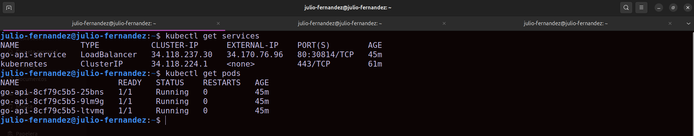
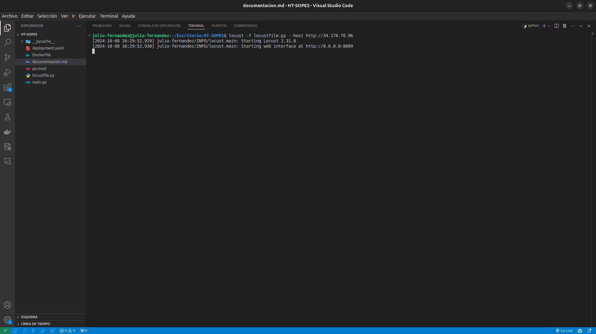
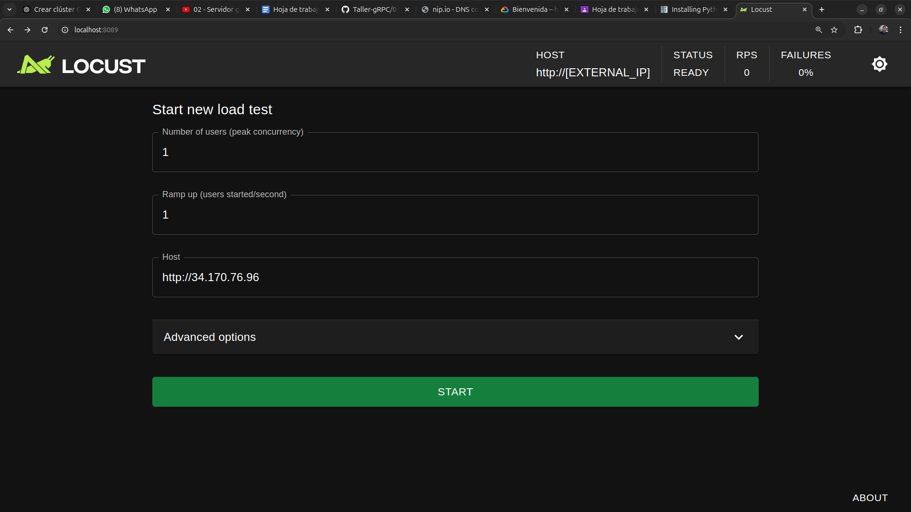
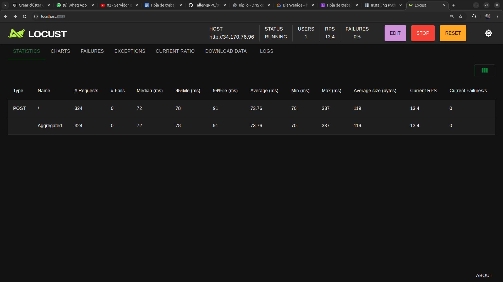
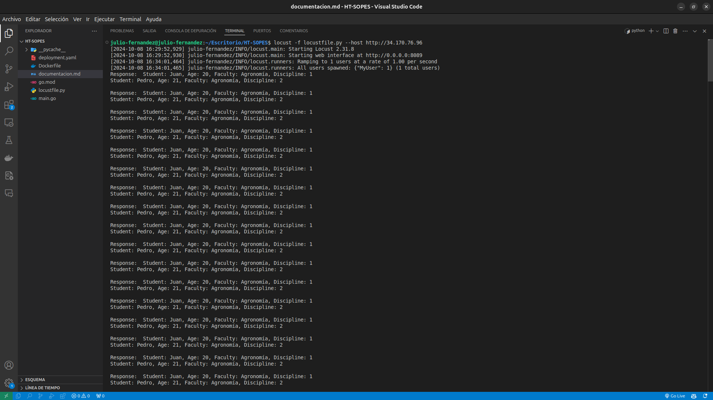

<div style="text-align: center;">
    <span style="font-size: 18px;">Universidad de San Carlos de Guatemala</span><br>
    <span style="font-size: 18px;">Facultad de Ingeniería</span><br>
    <span style="font-size: 18px;">Escuela de Ciencias y Sistemas</span><br>
    <span style="font-size: 18px;">Laboratorio de Sistemas de Bases de Datos 1 Sección B</span><br>
    <span style="font-size: 18px;">Julio Alfredo Fernández Rodríguez 201902416</span>
</div>

<br>


### 1. Configuración inicial del proyecto en Google Cloud

#### Paso 1: Configura el SDK de Google Cloud
```bash
gcloud init
```
- **¿Qué hace?**: Inicia el SDK de Google Cloud para que te conectes a tu cuenta de Google Cloud y selecciones un proyecto predeterminado. Te pedirá que inicies sesión con tu cuenta de Google y que elijas el proyecto con el que trabajarás.

#### Paso 2: Autenticación en Google Cloud
```bash
gcloud auth login
```
- **¿Qué hace?**: Abre una ventana de tu navegador para que inicies sesión con tu cuenta de Google. Esto es necesario para poder usar los servicios de Google Cloud desde la terminal.

### 2. Crear un proyecto en Google Cloud

#### Paso 3: Crear un proyecto de Google Cloud
```bash
gcloud projects create ht-sopes
```
- **¿Qué hace?**: Crea un nuevo proyecto en Google Cloud llamado **ht-sopes**. Un proyecto en Google Cloud es un contenedor que agrupa todos los recursos, como las máquinas virtuales, clústeres de Kubernetes, bases de datos, etc.

#### Paso 4: Establecer el proyecto actual
```bash
gcloud config set project ht-sopes
```
- **¿Qué hace?**: Configura **ht-sopes** como el proyecto predeterminado para todos los comandos futuros. Esto asegura que todos los recursos que crees o configures se creen en el proyecto correcto.

### 3. Habilitar las APIs necesarias

#### Paso 5: Habilitar la API de Kubernetes en Google Cloud
```bash
gcloud services enable container.googleapis.com
```
- **¿Qué hace?**: Habilita el uso de Google Kubernetes Engine (GKE), lo que te permite crear y gestionar clústeres de Kubernetes en Google Cloud.

### 4. Crear el clúster de Kubernetes en GKE

#### Paso 6: Crear el clúster en GKE
```bash
gcloud container clusters create cluster-ht-sopes --zone us-central1-a
```
- **¿Qué hace?**: Crea un clúster de Kubernetes llamado **cluster-ht-sopes** en la región **us-central1-a**. Un clúster de Kubernetes es un conjunto de máquinas virtuales (nodos) que ejecutan tus aplicaciones en contenedores (como Docker).

- **Opciones**:
  - `--zone us-central1-a`: Especifica la zona donde se creará el clúster. Puedes elegir otra región si lo prefieres.

#### Paso 7: Obtener credenciales del clúster
```bash
gcloud container clusters get-credentials cluster-ht-sopes --zone us-central1-a
```
- **¿Qué hace?**: Descarga y configura las credenciales necesarias para que tu `kubectl` (la herramienta de línea de comandos de Kubernetes) se conecte al clúster **cluster-ht-sopes**. Esto te permite administrar el clúster desde tu terminal.

### 5. Desplegar la aplicación Go

#### Paso 8: Crea tu aplicación en Go
Tu código Go, que recibe un JSON y lo muestra, debe estar en un archivo llamado `main.go`:

```go
package main

import (
	"encoding/json"
	"fmt"
	"log"
	"net/http"
)

type Student struct {
	Student   string `json:"student"`
	Age       int    `json:"age"`
	Faculty   string `json:"faculty"`
	Discipline int   `json:"discipline"`
}

func handler(w http.ResponseWriter, r *http.Request) {
	var students []Student
	err := json.NewDecoder(r.Body).Decode(&students)
	if err != nil {
		http.Error(w, err.Error(), http.StatusBadRequest)
		return
	}

	for _, student := range students {
		fmt.Fprintf(w, "Student: %s, Age: %d, Faculty: %s, Discipline: %d\n", student.Student, student.Age, student.Faculty, student.Discipline)
	}
}

func main() {
	http.HandleFunc("/", handler)
	log.Println("Server started on :8080")
	log.Fatal(http.ListenAndServe(":8080", nil))
}

```
Este código expone un servidor HTTP que recibe datos en formato JSON y los muestra en la consola.

#### Paso 9: Crear el Dockerfile
Crea un archivo llamado `Dockerfile` que definirá cómo crear la imagen Docker de tu aplicación:

```Dockerfile
FROM golang:1.23-alpine

WORKDIR /app

COPY go.mod ./
RUN go mod download

COPY *.go ./

RUN go build -o /app/api

EXPOSE 8080

CMD ["/app/api"]
```

- **¿Qué hace?**: Este archivo indica cómo crear la imagen Docker de tu aplicación Go.
  - `FROM golang:1.19-alpine`: Usa la imagen base de Go en una versión ligera de Alpine Linux.
  - `WORKDIR /app`: Establece el directorio de trabajo dentro del contenedor.
  - `COPY go.mod ./`, `COPY go.sum ./`: Copia los archivos de dependencias de Go.
  - `RUN go mod download`: Descarga las dependencias del proyecto.
  - `COPY *.go ./`: Copia el archivo Go al contenedor.
  - `RUN go build`: Construye la aplicación.
  - `EXPOSE 8080`: Expone el puerto 8080 en el contenedor.
  - `CMD ["/app/api"]`: Ejecuta la aplicación.

#### Paso 10: Construir la imagen de Docker
```bash
docker build -t gcr.io/ht-sopes/go-api .
```
- **¿Qué hace?**: Construye la imagen Docker de tu aplicación Go con el nombre `gcr.io/ht-sopes/go-api`.

#### Paso 11: Subir la imagen a Google Container Registry (GCR)
```bash
docker push gcr.io/ht-sopes/go-api
```
- **¿Qué hace?**: Sube la imagen Docker a Google Container Registry, que es el repositorio de imágenes de contenedores de Google Cloud.

### 6. Desplegar la aplicación en Kubernetes

#### Paso 12: Crear el archivo de despliegue de Kubernetes

Crea un archivo `deployment.yaml` para configurar el despliegue de la aplicación en Kubernetes:

```yaml
apiVersion: apps/v1
kind: Deployment
metadata:
  name: go-api
spec:
  replicas: 3
  selector:
    matchLabels:
      app: go-api
  template:
    metadata:
      labels:
        app: go-api
    spec:
      containers:
      - name: go-api
        image: gcr.io/ht-sopes/go-api
        ports:
        - containerPort: 8080
---
apiVersion: v1
kind: Service
metadata:
  name: go-api-service
spec:
  type: LoadBalancer
  ports:
    - port: 80          # Puerto expuesto
      targetPort: 8080  # Puerto en el pod donde está escuchando la aplicación
  selector:
    app: go-api  # Este debe coincidir con las etiquetas de los pods

```

- **¿Qué hace?**:
  - **Deployment**: Define el número de réplicas (3) de la aplicación que Kubernetes ejecutará.
  - **Service**: Expone la aplicación al exterior a través de un servicio de tipo `LoadBalancer`, que obtiene una IP externa.

#### Paso 13: Aplicar la configuración de Kubernetes
```bash
kubectl apply -f deployment.yaml
```
- **¿Qué hace?**: Aplica el archivo de configuración a tu clúster, desplegando la aplicación y exponiéndola al exterior.

### 7. Generar tráfico con Locust

#### Paso 14: Instalar Locust
```bash
pip install locust
```
- **¿Qué hace?**: Instala Locust, una herramienta para realizar pruebas de carga.

#### Paso 15: Crear el archivo de Locust
Crea un archivo `locustfile.py` que simulará la carga de tráfico hacia tu API:

```python
from locust import HttpUser, task

class MyUser(HttpUser):
    @task
    def send_data(self):
        payload = [
            { "student": "Juan", "age": 20, "faculty": "Agronomía", "discipline": 1 },
            { "student": "Pedro", "age": 21, "faculty": "Agronomía", "discipline": 2 }
        ]
        with self.client.post("/", json=payload, catch_response=True) as response:
            if response.status_code == 200:
                print("Response: ", response.text)  # Esto imprimirá la respuesta en la consola
            else:
                response.failure("Request failed with status code: {}".format(response.status_code))

```

- **¿Qué hace?**: Este script envía un JSON de ejemplo hacia tu API de Go utilizando la herramienta Locust.

#### Paso 16: Ejecutar Locust
```bash
locust -f locustfile.py --host http://34.170.76.96
```
- **¿Qué hace?**: Ejecuta Locust para empezar a generar tráfico hacia la API en el clúster de Kubernetes. El `EXTERNAL_IP` lo obtienes del servicio LoadBalancer:

```bash
kubectl get services
```

--- 

### Eliminar el clúster de Kubernetes

1. **Abre tu terminal** y asegúrate de que estás autenticado en Google Cloud y que el proyecto correcto está seleccionado.

2. **Ejecuta el siguiente comando** para eliminar el clúster:

   ```bash
   gcloud container clusters delete cluster-ht-sopes --zone us-central1-a
   ```

   **¿Qué hace?**: Este comando elimina el clúster de Kubernetes llamado `cluster-ht-sopes` en la zona `us-central1-a`. 

   **Nota**: Puede que te pida confirmación para proceder con la eliminación. Responde `Y` o `yes` para confirmar.

### Eliminar el proyecto de Google Cloud

1. **Asegúrate de que el proyecto está configurado correctamente**. Si no lo has hecho, establece el proyecto como el proyecto actual:

   ```bash
   gcloud config set project ht-sopes
   ```

2. **Ejecuta el siguiente comando** para eliminar el proyecto:

   ```bash
   gcloud projects delete ht-sopes
   ```

   **¿Qué hace?**: Este comando elimina el proyecto `ht-sopes` de Google Cloud, lo que también eliminará todos los recursos asociados a ese proyecto (como el clúster, las imágenes de contenedor, etc.).

   **Nota**: También puede que te pida confirmación para proceder con la eliminación. Responde `Y` o `yes` para confirmar.

### Resumen de comandos

Aquí tienes un resumen de los comandos que necesitas ejecutar:

```bash
gcloud container clusters delete cluster-ht-sopes --zone us-central1-a
gcloud projects delete ht-sopes
```

### Advertencias
- **Asegúrate de que ya no necesitas los recursos** antes de eliminarlos, ya que esta acción es irreversible.
- La eliminación de un proyecto borrará todos los recursos y datos asociados a él, así que ten cuidado.

Si necesitas más ayuda o información, ¡no dudes en preguntar!

---

### Demostracion del desarrollo de la hoja de trabajo

#### Objetivos:
- Utilizar Google Kubernetes Engine (GKE).
- Manejo de la herramienta Locust.
- Despliegue de aplicaciones contenerizadas en GKE.


#### Instrucciones:
- Crear un clúster de Kubernetes en Google Kubernetes Engine (GKE).
- Utilizar Locust como una herramienta para enviar tráfico de información.
- Desplegar una Appi en Go que reciba y muestre en pantalla la información obtenida.
- Tomar como ejemplo la estructura del JSON del Proyecto No. 2.

### Verificacion de services y pods 

<div align="center">
                        <a href="" target="_blank"></a>
</div>

### Verificacion del funcionamiento de locust

<div align="center">
                        <a href="" target="_blank"></a>
</div>


### Verificacion del la configuracion de locust

<div align="center">
                        <a href="" target="_blank"></a>
</div>

### Verificacion del estado de locust

<div align="center">
                        <a href="" target="_blank"></a>
</div>

### Verificacion del los logs
<div align="center">
                        <a href="" target="_blank"></a>
</div>