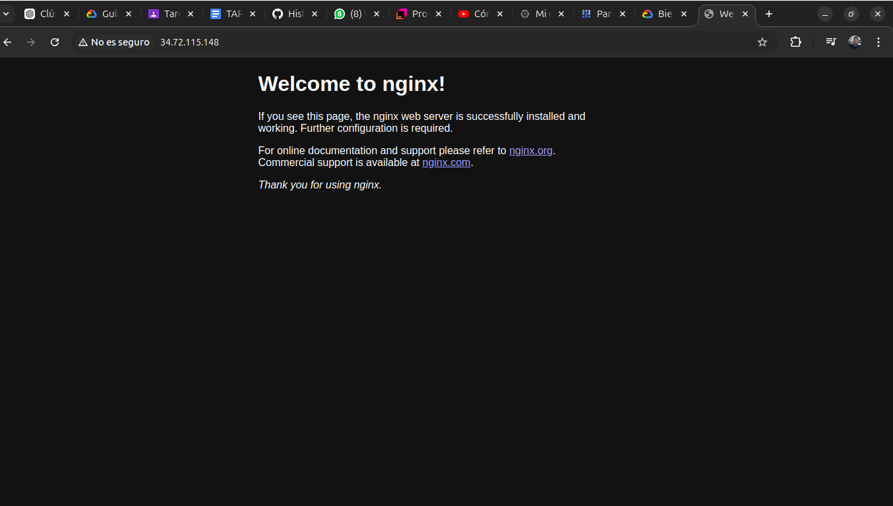

<div style="text-align: center;">
    <span style="font-size: 18px;">Universidad de San Carlos de Guatemala</span><br>
    <span style="font-size: 18px;">Facultad de Ingeniería</span><br>
    <span style="font-size: 18px;">Escuela de Ciencias y Sistemas</span><br>
    <span style="font-size: 18px;">Laboratorio de Sistemas de Bases de Datos 1 Sección B</span><br>
    <span style="font-size: 18px;">Julio Alfredo Fernández Rodríguez 201902416</span>
</div>

<br>


### 1. **Instalación de Google Cloud SDK**

1. **Verifica la versión de Python**  
   Asegúrate de tener instalada una versión compatible de Python. Google Cloud SDK requiere Python en las versiones 3.8 a 3.12. Ten en cuenta que el paquete x86_64 de Linux incluye un intérprete de Python empaquetado que se utilizará por defecto. Para más detalles sobre cómo seleccionar y configurar tu intérprete de Python, consulta `gcloud topic startup`.

2. **Descargar el archivo de instalación**  
   Para descargar el archivo de Linux, ejecuta el siguiente comando:
   ```bash
   curl -O https://dl.google.com/dl/cloudsdk/channels/rapid/downloads/google-cloud-cli-linux-x86_64.tar.gz
   ```
   Asegúrate de reemplazar `google-cloud-cli-linux-x86_64.tar.gz` por el nombre del paquete `*.tar.gz` que corresponda a tu configuración si es diferente.

3. **Extraer el contenido del archivo**  
   Para descomprimir el archivo en tu sistema de archivos (preferiblemente en tu directorio principal), ejecuta el siguiente comando:
   ```bash
   tar -xf google-cloud-cli-linux-x86_64.tar.gz
   ```

4. **Agregar gcloud CLI a tu ruta**  
   Ejecuta el script de instalación (desde la raíz de la carpeta a la que extrajiste) con el siguiente comando:
   ```bash
   ./google-cloud-sdk/install.sh
   ```
   Esto también se puede hacer de manera no interactiva (por ejemplo, con un script) proporcionando preferencias como marcas. Para ver las marcas disponibles, ejecuta el siguiente comando:
   ```bash
   ./google-cloud-sdk/install.sh --help
   ```

5. **Opcional: Envío de estadísticas de uso**  
   Si deseas enviar estadísticas de uso anónimas para ayudar a mejorar gcloud CLI, responde `Y` cuando se te pregunte (esto es opcional). Para agregar gcloud CLI a tu `PATH` y habilitar la finalización de comandos, responde `Y` cuando se te solicite. Abre una nueva terminal para que los cambios surtan efecto.

6. **Inicializar gcloud CLI**  
   Para inicializar la gcloud CLI, ejecuta el siguiente comando:
   ```bash
   ./google-cloud-sdk/bin/gcloud init
   ```

### Nota:
Sigue estas instrucciones cuidadosamente y asegúrate de que cada paso se complete antes de pasar al siguiente. Si tienes alguna duda o necesitas más ayuda, no dudes en preguntar. ¡Buena suerte con la instalación!

### 2. **Autenticación en tu cuenta de Google Cloud**
   - Ejecutaste el comando:
     ```bash
     gcloud auth login
     ```

### 3. **Creación de un nuevo proyecto**
   - Creaste un nuevo proyecto llamado `mi-proyecto-k8s`:
     ```bash
     gcloud projects create mi-proyecto-k8s
     ```

### 4. **Configuración del proyecto**
   - Configuraste tu proyecto actual:
     ```bash
     gcloud config set project mi-proyecto-k8s
     ```

### 5. **Habilitación de APIs necesarias**
   - Habilitaste la API de Kubernetes Engine:
     ```bash
     gcloud services enable container.googleapis.com
     ```

### 6. **Creación del clúster de Kubernetes**
   - Creaste un clúster de Kubernetes llamado `mi-cluster-k8s` en la zona `us-central1-a`:
     ```bash
     gcloud container clusters create mi-cluster-k8s --zone us-central1-a
     ```

### 7. **Configuración de `kubectl`**
   - Instalaste el plugin `gke-gcloud-auth-plugin` (comando aún pendiente):
     ```bash
     gcloud components install gke-gcloud-auth-plugin
     ```
   - Actualizaste la configuración de `kubectl`:
     ```bash
     gcloud container clusters get-credentials mi-cluster-k8s --zone us-central1-a
     ```

### 8. **Despliegue de NGINX**
   - Desplegaste NGINX en el clúster:
     ```bash
     kubectl create deployment nginx --image=nginx
     ```

### 9. **Exposición del servicio NGINX**
   - Exponiste el servicio NGINX usando un LoadBalancer:
     ```bash
     kubectl expose deployment nginx --type=LoadBalancer --port 80
     ```

### 10. **Verificación del servicio**
   - Consultaste los servicios para obtener la dirección IP pública:
     ```bash
     kubectl get services
     ```

### 11. **Eliminación del clúster (pendiente)**
   - Después de probar NGINX, puedes eliminar el clúster con el siguiente comando:
     ```bash
     gcloud container clusters delete mi-cluster-k8s --zone us-central1-a
     ```

### Resumen
- **Proyecto creado:** `mi-proyecto-k8s`
- **Clúster creado:** `mi-cluster-k8s` en `us-central1-a`
- **API habilitada:** Kubernetes Engine


---
### Pruebas utilizando la EXTERNAL-IP

### 1. **Obtener la IP pública del servicio NGINX**
Ejecuta el siguiente comando para obtener la dirección IP pública asignada a tu servicio NGINX:

```bash
kubectl get services
```

Deberías ver una salida similar a esta:

```
NAME        TYPE           CLUSTER-IP     EXTERNAL-IP      PORT(S)        AGE
nginx        LoadBalancer   34.118.231.54   34.72.115.148   80:31402/TCP   42s

```

### 2. **Acceder a la IP pública**
- Abre un navegador web y escribe la dirección IP en la barra de direcciones, por ejemplo:

```
http://34.72.115.148
```

### 3. **Verificar el servidor NGINX**
Si todo está funcionando correctamente, deberías ver la página de bienvenida de NGINX, que indica que el servidor se ha desplegado con éxito.

### 4. **Prueba desde la terminal (opcional)**
También puedes realizar una prueba simple utilizando `curl` desde la terminal.
```bash
curl http://34.72.115.148
```

Esto debería devolver el HTML de la página de bienvenida de NGINX.

### 5. **Eliminar el clúster (opcional)**
Una vez que hayas terminado de probar y no necesites el clúster, puedes eliminarlo para evitar costos innecesarios con el siguiente comando:

```bash
gcloud container clusters delete mi-cluster-k8s --zone us-central1-a
```

Después de probar NGINX, puedes eliminar el clúster con el siguiente comando

Para eliminar un proyecto en Google Cloud Platform (GCP) usando el SDK de Google Cloud (`gcloud`), puedes seguir estos pasos. Ten en cuenta que eliminar un proyecto es una acción permanente y no se puede deshacer, así que asegúrate de que realmente deseas eliminar el proyecto.

### Pasos para eliminar un proyecto

1. **Abre la terminal**: Asegúrate de que tienes abierta la terminal o línea de comandos.

2. **Autentícate (si es necesario)**: Si no te has autenticado, ejecuta:
   ```bash
   gcloud auth login
   ```

3. **Establece el proyecto actual (opcional)**: Si quieres eliminar un proyecto específico, primero puedes establecerlo como el proyecto actual (esto es opcional, pero puede ser útil). Por ejemplo, para establecer `mi-proyecto-k8s` como el proyecto actual:
   ```bash
   gcloud config set project mi-proyecto-k8s
   ```

4. **Elimina el proyecto**: Ejecuta el siguiente comando para eliminar el proyecto que deseas. Reemplaza `PROJECT_ID` con el ID del proyecto que deseas eliminar (en tu caso, puede ser `mi-proyecto-k8s` o `peerless-rite-436816-p4`):

   ```bash
   gcloud projects delete PROJECT_ID
   ```

   Por ejemplo, si deseas eliminar `mi-proyecto-k8s`:
   ```bash
   gcloud projects delete mi-proyecto-k8s
   ```

5. **Confirmación**: Durante el proceso, se te pedirá que confirmes que realmente deseas eliminar el proyecto. Sigue las instrucciones en pantalla.

### Notas importantes:

- **Consecuencias de la eliminación**: Todos los recursos asociados con el proyecto (como máquinas virtuales, bases de datos, etc.) se eliminarán de forma permanente. Asegúrate de hacer una copia de seguridad de cualquier dato importante antes de proceder.
- **Permisos**: Necesitas tener permisos suficientes para eliminar el proyecto. Si no tienes los permisos necesarios, no podrás completar la acción.
  

--- 
### Explicacion

Explicación de cada paso se reaalizo en la instalación y configuración de Google Cloud SDK y Kubernetes. Esto ayudará a entender qué hace cada parte del proceso.

### 1. **Instalación de Google Cloud SDK**

**Google Cloud SDK** es una colección de herramientas que te permite interactuar con los servicios de Google Cloud. Incluye la herramienta de línea de comandos `gcloud`, que es fundamental para gestionar recursos en Google Cloud.

1. **Verifica la versión de Python**: 
   - Google Cloud SDK requiere Python para funcionar. Aquí se asegura de que tengas una versión compatible.

2. **Descargar el archivo de instalación**: 
   - Usas `curl` para descargar el archivo comprimido que contiene Google Cloud SDK. Este comando obtiene el archivo necesario para la instalación.

3. **Extraer el contenido del archivo**: 
   - Descomprimes el archivo que descargaste, lo que crea una carpeta con los archivos necesarios para el SDK.

4. **Agregar gcloud CLI a tu ruta**: 
   - Ejecutas el script de instalación que configura el SDK en tu sistema. Esto permite que puedas usar los comandos `gcloud` desde cualquier terminal.

5. **Opcional: Envío de estadísticas de uso**: 
   - Aquí tienes la opción de enviar datos anónimos sobre cómo utilizas `gcloud`, lo que puede ayudar a mejorar el servicio. También puedes elegir si deseas que se agregue el SDK a tu `PATH`, facilitando su uso.

6. **Inicializar gcloud CLI**: 
   - Al ejecutar este comando, configuras `gcloud` por primera vez. Te pedirá que inicies sesión en tu cuenta de Google Cloud y que elijas un proyecto predeterminado.

### 2. **Autenticación en tu cuenta de Google Cloud**
   - Utilizas `gcloud auth login` para autenticarte. Esto abrirá un navegador para que inicies sesión en tu cuenta de Google Cloud y otorgues permisos a `gcloud` para gestionar tus recursos.

### 3. **Creación de un nuevo proyecto**
   - Con `gcloud projects create mi-proyecto-k8s`, creas un nuevo proyecto en Google Cloud. Un proyecto es un contenedor para todos tus recursos en Google Cloud.

### 4. **Configuración del proyecto**
   - Al ejecutar `gcloud config set project mi-proyecto-k8s`, configuras tu proyecto actual. Esto significa que todos los comandos futuros que ejecutes con `gcloud` afectarán a este proyecto.

### 5. **Habilitación de APIs necesarias**
   - Con `gcloud services enable container.googleapis.com`, habilitas la API de Kubernetes Engine. Esta API permite gestionar clústeres de Kubernetes en Google Cloud.

### 6. **Creación del clúster de Kubernetes**
   - Usando `gcloud container clusters create mi-cluster-k8s --zone us-central1-a`, creas un clúster de Kubernetes llamado `mi-cluster-k8s` en la zona `us-central1-a`. Un clúster de Kubernetes es un grupo de servidores (nodos) que gestionan la implementación y operación de aplicaciones en contenedores.

### 7. **Configuración de `kubectl`**
   - `kubectl` es la herramienta de línea de comandos para interactuar con Kubernetes. 
   - Primero, instalas el plugin `gke-gcloud-auth-plugin`, que permite a `kubectl` usar tus credenciales de Google Cloud para autenticarte en el clúster de Kubernetes.
   - Luego, ejecutas `gcloud container clusters get-credentials mi-cluster-k8s --zone us-central1-a`, que configura `kubectl` para interactuar con tu clúster de Kubernetes recién creado.

### 8. **Despliegue de NGINX**
   - Ejecutas `kubectl create deployment nginx --image=nginx` para crear un despliegue en tu clúster de Kubernetes. Esto lanza una instancia del servidor web NGINX, que es útil para servir contenido web.

### 9. **Exposición del servicio NGINX**
   - Con `kubectl expose deployment nginx --type=LoadBalancer --port 80`, creas un servicio que expone tu despliegue de NGINX al exterior. Al usar `LoadBalancer`, Google Cloud creará una dirección IP pública para acceder a tu servicio.

### 10. **Verificación del servicio**
   - Ejecutas `kubectl get services` para listar todos los servicios en tu clúster y obtener la dirección IP pública de NGINX. 

### 11. **Eliminación del clúster (pendiente)**
   - Finalmente, proporcionas el comando para eliminar el clúster una vez que hayas terminado de probar NGINX, liberando recursos y evitando costos innecesarios.

### **Pruebas utilizando la EXTERNAL-IP**
Aquí, realizas pruebas para verificar que tu despliegue de NGINX está funcionando correctamente utilizando la dirección IP pública.

1. **Obtener la IP pública del servicio NGINX**: 
   - Obtienes la dirección IP pública que te permitirá acceder al servicio NGINX que has desplegado.

2. **Acceder a la IP pública**: 
   - Abres un navegador e ingresas la dirección IP para ver la página de bienvenida de NGINX.

3. **Verificar el servidor NGINX**: 
   - Si ves la página de bienvenida, significa que NGINX está funcionando correctamente.

4. **Prueba desde la terminal (opcional)**: 
   - También puedes usar `curl` desde la terminal para hacer una solicitud al servicio y ver la respuesta.

5. **Eliminar el clúster (opcional)**: 
   - Proporcionas el comando para eliminar el clúster una vez que has terminado con tus pruebas.

### **Resumen**
- Has creado un proyecto en Google Cloud y un clúster de Kubernetes.
- Has desplegado un servidor web NGINX y lo has expuesto para acceder públicamente.
- Has realizado pruebas para asegurarte de que todo funciona correctamente.

### ¿Por qué es importante esto?
El uso de Kubernetes en la nube te permite gestionar aplicaciones en contenedores de manera eficiente, facilitando el escalado, la gestión de recursos y la implementación de aplicaciones. Al aprender a utilizar Google Cloud SDK y Kubernetes, estás adquiriendo habilidades valiosas en el desarrollo y la operación de aplicaciones modernas. Si tienes más preguntas o quieres profundizar en un área específica, ¡no dudes en preguntar!

---
### Un poco de teoria

Repasaremos cada concepto importante.

### 1. **SDK (Software Development Kit)**

- **Qué es**: Un SDK es un conjunto de herramientas, bibliotecas y documentación que permite a los desarrolladores crear aplicaciones para una plataforma específica.
- **Ejemplo**: Si quieres crear una aplicación para Android, usarías el **Android SDK**. Este kit incluye todo lo necesario para programar, como un emulador para probar tu app y bibliotecas para acceder a la cámara del teléfono.

### 2. **Kubernetes**

- **Qué es**: Kubernetes es un sistema que ayuda a gestionar aplicaciones que están empaquetadas en contenedores (como Docker). Automatiza tareas como el despliegue, escalado y operación de estas aplicaciones.
- **Ejemplo**: Imagina que tienes una tienda en línea. En lugar de instalar todo en una computadora, empaquetas tu aplicación en contenedores. Kubernetes se encarga de que siempre haya suficientes contenedores funcionando, y si uno falla, lo reinicia automáticamente.

### 3. **Google Cloud Platform (GCP)**

- **Qué es**: GCP es un conjunto de servicios en la nube ofrecidos por Google. Puedes almacenar datos, ejecutar aplicaciones y mucho más.
- **Ejemplo**: Si deseas que tu tienda en línea esté disponible en Internet, puedes usar GCP para alojar tu base de datos y tu aplicación sin tener que comprar servidores físicos.

### 4. **NGINX**

- **Qué es**: NGINX es un servidor web que puede servir archivos estáticos (como HTML, CSS y JavaScript) y también puede actuar como un **proxy**. Un proxy es un intermediario que recibe solicitudes de los usuarios y se las pasa a otro servidor. Luego, recibe la respuesta y se la envía al usuario.
  
- **Ejemplo claro**:
  - **Sin NGINX**: Supongamos que tienes una aplicación que recibe muchas solicitudes de usuarios. Si todos los usuarios van directamente a tu servidor de aplicaciones, este puede saturarse y no funcionar correctamente.
  - **Con NGINX**: Aquí es donde entra NGINX. Los usuarios envían sus solicitudes a NGINX, que actúa como el primer punto de contacto. NGINX recibe las solicitudes, las procesa y decide qué hacer:
    - **Sirve contenido estático**: Si un usuario solicita una imagen o una página web simple, NGINX puede enviarle directamente esa información sin molestar al servidor de aplicaciones.
    - **Proxy para contenido dinámico**: Si la solicitud requiere información más compleja (como datos de una base de datos), NGINX se la pasa a tu servidor de aplicaciones (donde se ejecuta la lógica de negocio), espera la respuesta y luego se la envía al usuario.

### 5. **kubectl**

- **Qué es**: `kubectl` es una herramienta de línea de comandos que te permite interactuar con tu clúster de Kubernetes. Con esta herramienta, puedes gestionar tus aplicaciones y recursos en Kubernetes.
- **Ejemplo**: Si has creado un despliegue de tu tienda en línea en Kubernetes, puedes usar `kubectl` para actualizarla, ver los registros de eventos o comprobar el estado de los contenedores.

### Resumen Visual

1. **Usuario**: Hace una solicitud (por ejemplo, abrir tu tienda en línea).
2. **NGINX**: 
   - Recibe la solicitud.
   - Si es un archivo estático (como una imagen), lo sirve directamente.
   - Si necesita datos de la aplicación, se convierte en un proxy y reenvía la solicitud a tu servidor de aplicaciones.
3. **Servidor de Aplicaciones**: Procesa la solicitud, obtiene los datos necesarios (por ejemplo, información de productos) y se los envía de vuelta a NGINX.
4. **NGINX**: Envía la respuesta al usuario.

### Ejemplo Completo de una Aplicación

Imagina que tienes una tienda en línea:

1. **Desarrollo**: Usas el **Google Cloud SDK** para interactuar con GCP.
2. **Alojamiento**: Creas un clúster de **Kubernetes** en GCP para gestionar la tienda.
3. **Contenedores**: Empaquetas tu aplicación en contenedores usando Docker.
4. **NGINX**: Configuras NGINX para que maneje todas las solicitudes a tu tienda. NGINX se asegura de que las páginas estáticas se sirvan rápidamente y que las solicitudes más complejas se envíen a tu servidor de aplicaciones.
5. **Gestión**: Usas `kubectl` para desplegar la aplicación en el clúster de Kubernetes y gestionarla.

### Conclusión

NGINX juega un papel crucial en el rendimiento y la escalabilidad de tus aplicaciones al actuar como un intermediario que maneja las solicitudes de los usuarios. Al hacer esto, alivia la carga de tu servidor de aplicaciones y mejora la experiencia del usuario al servir contenido rápidamente. Si algo no está claro o necesitas más detalles, ¡avísame!

---

### Demostracion del desarrollo de la tarea 

#### Objetivos:
- Crear un clúster de Kubernetes en Google Kubernetes Engine (GKE).
- Desplegar la aplicación NGINX y exponerla públicamente.

#### Instrucciones:
- Configura Google Cloud SDK y autentícate en tu cuenta.
- Crea un nuevo proyecto en Google Cloud Platform y habilita la API de Kubernetes Engine.
- Genera un clúster de Kubernetes en GKE.
- Despliega NGINX en el clúster y expón el servicio utilizando un LoadBalancer.
- Verifica que el servidor NGINX esté funcionando al acceder a la IP pública del servicio.
- limina el clúster para evitar costos innecesarios.

### Verificacion de instalacion de Google Cloud SDK

<div align="center">
                        <a href="" target="_blank"></a>
</div>


### Autenticación en tu cuenta de Google Cloud

<div align="center">
                        <a href="" target="_blank"></a>
</div>

### Proyecto creado
<div align="center">
                        <a href="" target="_blank"></a>
</div>

### Creación del clúster de Kubernetes

<div align="center">
                        <a href="" target="_blank"></a>
</div>

### Configuración de kubectl
<div align="center">
                        <a href="" target="_blank"></a>
</div>


### Acceder a la IP pública
<div align="center">
                        <a href="" target="_blank"></a>
</div>

